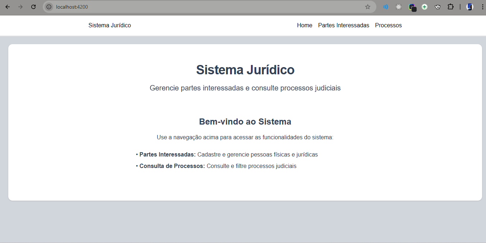
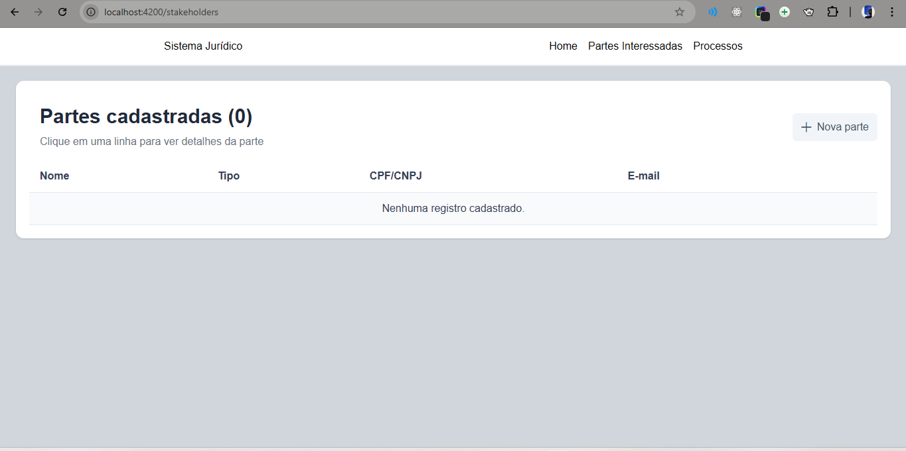
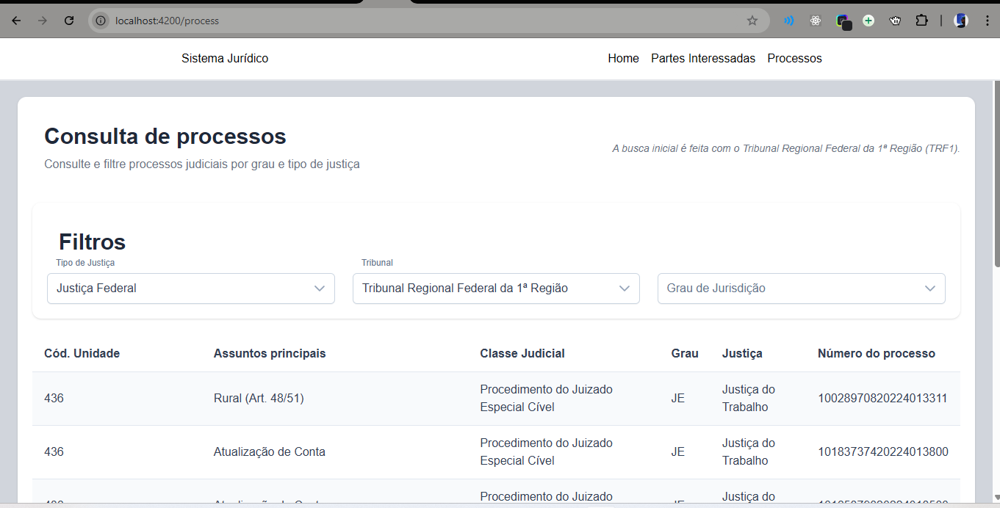
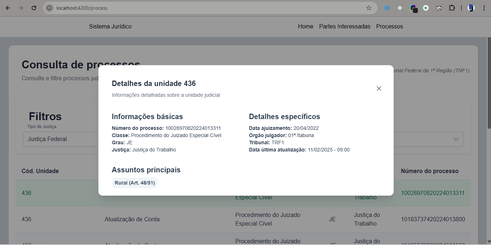

# ProjectAngular

O projeto consite numa aplicação Angular que permite: 
-   Cadastrar partes interessadas.
-   Consultar dados públicos de processos judiciais a partir da API do CNJ.
-   Exibir e filtrar os resultados de forma clara e organizada.

O objetivo do projeto foi criar uma aplicação angular seguindo as boas práticas de código e arquitetura.

## Páginas
### Home


A página inicial apresenta uma interface limpa e intuitiva com:
- Barra de navegação superior com logo e menu
- Textos simples de identificando as funções de cada página.

### Partes Interessadas


A página apresenta a listagem das partes interessadas que foram cadastradas no sistema e um botão para navegar o usuário até a página de cadastro das partes.

### Consulta de processos



A página possui uma listagem dos processos com base no filtro selecionado. Ao clicar em cada item da lista, é exibido uma modal com as informações detalhadas.

### Informações detalhadas

Modal contendo as informações detalhadas de cada processo.

## 1 - Tecnologias

### Framework e Linguagem
- Angular CLI versão 19.2.14
- TypeScript como linguagem principal
- RxJS para programação reativa
- HttpClient para consumo de API externa
- Angular Reactive Forms para o formulário

### UI/UX
- TailwindCSS para estilização
- PrimeNG como biblioteca de componentes UI
- PrimeIcons para ícones

### Armazenamento e Utilitários
- Dexie para banco de dados IndexedDB
- UUID para geração de identificadores únicos
- ngx-spinner para indicadores de carregamento

## 2 - Estrutura do Projeto

### Organização
- Estrutura padrão Angular com diretório src
- Configuração de ambiente separada
- Configuração de proxy para desenvolvimento

## 3 - Configuração de Desenvolvimento

### Ambiente
- Servidor de desenvolvimento na porta 4200
- Hot-reload habilitado
- Suporte a testes unitários

### Ferramentas
- Suporte TypeScript com configurações específicas
- Configuração do editor (.editorconfig)
- Gerenciamento de dependências com pnpm

## 4 - Scripts Disponíveis
- `ng serve` ou `npm start` para desenvolvimento local
- `ng build` para produção
- `ng build --watch` para build em modo watch

## Development server

Para iniciar o servidor de desenvolvimento local, execute:

```bash
ng serve
```

Após iniciar o servidor, abra seu navegador e acesse `http://localhost:4200/`. A aplicação será recarregada automaticamente sempre que você modificar qualquer um dos arquivos fonte.
